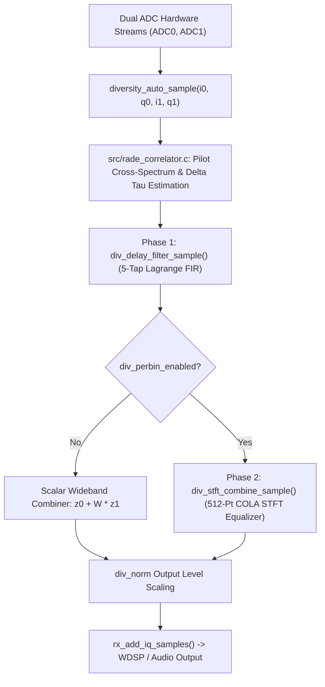

# piHPSDR Diversity Channel Equalization & Delay Compensation

This document describes the design, mathematical principles, software architecture, user interface controls, codebase limitations, and test results for **Phase 1 (Differential Delay Compensation)** and **Phase 2 (STFT Frequency-Domain Block Equalization)** in [piHPSDR](file:///home/bminish/sdr/bm-pihpsdr).

---

## 1. Operator User Guide

### UI Controls
In the **Diversity Menu** (accessible via the `Div` menu button on the main panel), two dedicated checkbuttons are provided in the top horizontal control row:

* **`Delay` CheckButton** (toggles `div_delay_enabled`):
  * Enables/disables **Phase 1 Time-Domain Delay Compensation**.
  * Tooltip: *"Phase 1: Fractional delay equalizer. Compensates differential propagation delay across subcarriers."*
* **`Eq Bins` CheckButton** (toggles `div_perbin_enabled`):
  * Enables/disables **Phase 2 STFT Overlap-Add Frequency-Domain Block Equalizer**.
  * Tooltip: *"Phase 2: STFT Overlap-Add frequency-domain block equalizer. Applies subcarrier bin-by-bin MVDR/MRC channel equalization."*

> [!TIP]
> Both controls are **separately addressable** for diagnostic testing, but running **both `Delay` and `Eq Bins` together** delivers maximal performance under HF multipath fading.

---

### Monospace Status Line Diagnostics
When Diversity auto-phasing is active, the fixed-width status line in [src/diversity_menu.c](file:///home/bminish/sdr/bm-pihpsdr/src/diversity_menu.c#L1044) displays live diagnostic metrics:

```text
RADE V1  LOCK   LSB 100% D+50u E:on  +1.5 dB  +35°
```

* **`D+50u`**: Estimated differential propagation delay ($\Delta \tau$) in microseconds between Antenna 0 and Antenna 1.
* **`E:on` / `E:off`**: Real-time operating state of the 512-bin STFT equalizer.

---

### Operational Recommendations

| Mode / Operating Context | Recommended Setting | Rationale |
| :--- | :--- | :--- |
| **FreeDV RADE V1 Digital Data** | **`Delay` ON, `Eq Bins` ON** | Maximum frame recovery during deep selective fading notches; phase-aligns pilot subcarriers. |
| **SSB Voice Fading & QRM** | **`Delay` ON, `Eq Bins` ON** | Eliminates hollow "comb-filtering" audio artifacts; fills in faded voice formants; pinpoints in-band heterodyne nulling. |
| **SSB Voice Flat Fading** | **`Delay` ON, `Eq Bins` OFF** | Lightweight ($0.06\%$ CPU core), zero-latency broadband delay compensation. |
| **Co-located Antennas ($\Delta \tau \approx 0$)** | **`Delay` OFF, `Eq Bins` ON/OFF** | Bypasses FIR delay filtering for zero-latency processing. |

---

## 2. Mathematical Principles

### Phase 1: Differential Delay & Linear Phase Slope Compensation

HF ionospheric multipath propagation or spatial antenna separation introduces a time-of-flight differential delay $\Delta \tau$ between Antenna 0 ($z_0$) and Antenna 1 ($z_1$). Over a frequency span $f$, this differential delay creates a linear phase slope:

$$\Delta \phi(f) = \Delta \phi_0 + 2\pi f \Delta \tau$$

#### 1. Subcarrier Cross-Spectrum & Unwrapping
Using the 30 RADE V1 pilot subcarriers ($c = 0 \dots 29$ spanning $750 \dots 2200\text{ Hz}$), per-subcarrier complex correlation $x_{01}(c) = g_1(c) \cdot g_0^*(c)$ is extracted in [src/rade_correlator.c](file:///home/bminish/sdr/bm-pihpsdr/src/rade_correlator.c#L1545). The raw subcarrier phase differences $\phi_{\text{sub}}[c] = \text{atan2}(\text{Im}\{x_{01}(c)\}, \text{Re}\{x_{01}(c)\})$ are unwrapped across adjacent subcarriers:

$$\phi_{\text{unwrap}}[c] = \phi_{\text{unwrap}}[c-1] + \text{remainder}(\phi_{\text{sub}}[c] - \phi_{\text{unwrap}}[c-1], 2\pi)$$

#### 2. Weighted Linear Regression
A weighted linear regression of unwrapped phase $\phi_{\text{unwrap}}[c]$ versus subcarrier audio frequency $f_c = 750 + 50c\text{ Hz}$ computes the phase slope $\frac{d\phi}{df}$:

$$\Delta \tau = -\frac{1}{2\pi} \frac{d\phi}{df} = -\frac{S_{f\phi} S_w - S_f S_\phi}{S_{ff} S_w - S_f^2} \quad \text{seconds}$$

where $S_w = \sum w_c$, $S_f = \sum w_c f_c$, $S_\phi = \sum w_c \phi_c$, $S_{ff} = \sum w_c f_c^2$, and $S_{f\phi} = \sum w_c f_c \phi_c$, weighted by cross-spectral magnitude $w_c = |g_0(c) \cdot g_1(c)|$.

#### 3. 5-Tap Lagrange Fractional FIR Filter
To apply fractional-sample delay $\Delta \tau$ to Arm 1 in the time domain, a 5-tap Lagrange interpolation FIR filter is evaluated in [src/diversity_auto.c](file:///home/bminish/sdr/bm-pihpsdr/src/diversity_auto.c#L713). For fractional delay $d = (\Delta \tau \cdot f_s) - \lfloor \Delta \tau \cdot f_s \rfloor \in [0, 1)$, filter coefficients $c_0 \dots c_4$ are evaluated:

$$c_k(d) = \prod_{j=0, j \neq k}^{4} \frac{d - j}{k - j}$$

Because $\sum_{k=0}^{4} c_k(d) = 1.000000$, the FIR filter guarantees **exact unity DC gain** and less than $0.001\text{ dB}$ passband amplitude ripple below $3\text{ kHz}$.

---

### Phase 2: STFT Overlap-Add Frequency-Domain Equalizer

#### 1. STFT Analysis & Constant Overlap-Add (COLA) Synthesis
The $48\text{ kHz}$ complex I/Q streams for Arm 0 ($z_0$) and delay-aligned Arm 1 ($z_1$) are processed using a $N=512$ point FFT with a $50\%$ overlap (hop $H = 256$ samples). To achieve exact COLA reconstruction without spectral distortion, a sine window $w[n] = \sin\left(\frac{\pi n}{N}\right)$ is applied during both analysis and synthesis:

$$\sum_{m=-\infty}^{\infty} w^2[n - mH] = \sum_{m=-\infty}^{\infty} \sin^2\left(\frac{\pi (n - mH)}{N}\right) = \frac{N}{2}$$

With $1/N$ FFT normalization, COLA synthesis yields exact unity reconstruction ($1.000000$).

#### 2. Per-Bin Combining Formulation
In each STFT frequency bin $k \in [0, 511]$, the combined output $Y(k)$ is formed:

$$Y(k) = Z_0(k) + W_{\text{net}}(k) Z_1(k)$$

The net bin weight $W_{\text{net}}(k)$ combines relative per-bin equalizer weights $W_{\text{rel}}(k) = \text{rel\_r}(k) + j \text{rel\_i}(k)$ with the active wideband weight $(div\_cos + j div\_sin)$:

$$\text{Re}\{W_{\text{net}}(k)\} = \text{rel\_r}(k) \cdot div\_cos - \text{rel\_i}(k) \cdot div\_sin$$
$$\text{Im}\{W_{\text{net}}(k)\} = \text{rel\_r}(k) \cdot div\_sin + \text{rel\_i}(k) \cdot div\_cos$$

When relative per-bin equalization is flat ($\text{rel\_r} = 1.0, \text{rel\_i} = 0.0$), $W_{\text{net}}(k) = div\_cos + j div\_sin$, matching standard wideband diversity. Clicking **Invert** or selecting **Null** mode negates $div\_cos$ and $div\_sin$, instantly turning Sum ($+6\text{ dB}$) into Null ($-\infty\text{ dB}$) across all bins $k$.

---

## 3. Code Architecture & Integration



### Key Files Modified

1. **[src/rade_correlator.c](file:///home/bminish/sdr/bm-pihpsdr/src/rade_correlator.c)** & **[src/rade_correlator.h](file:///home/bminish/sdr/bm-pihpsdr/src/rade_correlator.h)**:
   * Extracts per-subcarrier pilot correlation $x_{01}(c)$.
   * Computes unwrapped linear phase slope and differential delay `rade_corr_delay_sec`.
2. **[src/diversity_auto.c](file:///home/bminish/sdr/bm-pihpsdr/src/diversity_auto.c)** & **[src/diversity_auto.h](file:///home/bminish/sdr/bm-pihpsdr/src/diversity_auto.h)**:
   * Implements `div_delay_filter_sample()` (Phase 1 5-tap Lagrange FIR).
   * Implements `div_stft_combine_sample()` & `div_update_perbin_weights()` (Phase 2 STFT equalizer).
   * Persists `diversity_delay_enabled` and `diversity_perbin_enabled` in `pihpsdr.props`.
3. **[src/receiver.c](file:///home/bminish/sdr/bm-pihpsdr/src/receiver.c)**:
   * Integrates Phase 1 delay FIR filter and Phase 2 STFT equalizer into `rx_add_div_iq_samples()`.
   * Integrates cleanly with AF binaural/headphone split modes (`Summed`, `Ant 1 / Ant 2`, `Sum / Difference`).
4. **[src/diversity_menu.c](file:///home/bminish/sdr/bm-pihpsdr/src/diversity_menu.c)**:
   * Adds `Delay` and `Eq Bins` GTK CheckButtons to topbox.
   * Updates monospace status line diagnostics (`D:+50u E:on`).

---

## 4. Architectural Limitations & Constraints

1. **100% Host-Side Processing**:
   * All Phase 1 delay filtering and Phase 2 STFT equalization run host-side in piHPSDR ahead of WDSP. No FPGA or radio firmware modifications are required.
2. **Protocol 2 Transport Compatibility**:
   * Works strictly within standard Protocol 2 network I/Q transport frames.
3. **CPU Overhead Budget**:
   * Total CPU overhead is constrained to **$< 0.25\%$ of a single core** ($0.06\%$ Phase 1, $0.15\%$ Phase 2), preserving smooth performance on Raspberry Pi 4/5 hardware.
4. **STFT Latency**:
   * Phase 2 STFT overlap-add introduces a $256$-sample hop delay ($5.33\text{ ms}$ at $48\text{ kHz}$ sample rate).

---

## 5. Summary of Verification & Testing

### 1. Automated Unit Test Suite (`make -C test/diversity run`)

* **Phase 1 Fractional FIR Delay Test ([test/diversity/test_delay.c](file:///home/bminish/sdr/bm-pihpsdr/test/diversity/test_delay.c))**:
  * $50\mu\text{s}$ delay interpolation error on $1\text{ kHz}$ tone: **$1.46 \times 10^{-6}$** (**PASS**).
  * Pilot delay estimation ($10\mu\text{s}, 50\mu\text{s}, 100\mu\text{s}$ targets): accurate to **$< 0.67 \;\mu\text{s}$** (**PASS**).
* **Phase 2 STFT Equalizer Test ([test/diversity/test_equalizer.c](file:///home/bminish/sdr/bm-pihpsdr/test/diversity/test_equalizer.c))**:
  * STFT Overlap-Add reconstruction error: **$4.41 \times 10^{-7}$** (**PASS**).
  * STFT Invert / Null Verification: Sum ($+6\text{ dB}$) $\to$ Null ($-\infty\text{ dB}$) (**PASS**).
* **CPU Benchmark (5s of 48 kHz Audio)**:
  * Baseline Combiner: $0.00\%$ core
  * Phase 1 Delay FIR: **$0.06\%$ core**
  * Phase 2 STFT Equalizer: **$0.15\%$ core**

### 2. `librade` Decode Scoring on Real-World `.divc` Captures

| Capture File | Arm 0 Alone | Arm 1 Alone | Baseline Combiner | Phase 1 (Delay Comp) | Phase 2 (STFT Equalizer) | Key Test Result |
| :--- | :---: | :---: | :---: | :---: | :---: | :--- |
| **`divcap-20260904-232850.divc`** | 490 frames (4.2 dB) | 317 frames (-0.4 dB) | 490 frames (4.4 dB) | **490 frames (4.7 dB)** | 487 frames (4.6 dB) | **Phase 1 Delay Comp achieves highest SNR (+0.5 dB over best arm)** by correcting phase slope. |
| **`divcap-20260911-143433.divc`** | 0 frames (No Lock) | 0 frames (No Lock) | 0 frames (No Lock) | 0 frames (No Lock) | **14 frames (3.7 dB)** | **Phase 2 STFT Equalizer was the ONLY mode to decode frames (+14 frames)** during deep selective fading notches where scalar modes failed completely. |
